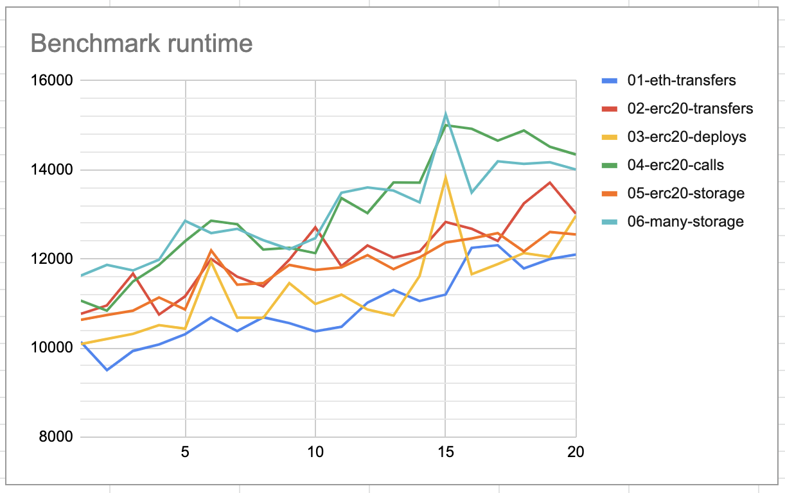

# Ethereumjs-vm performance research

## Execution hotspots

This includes items that take significant >1% of time in the benchmark. It excludes items that couldn't be easily identified or are not a part of ethereumjs and its dependencies (like ganache-core or ethers).

* `01-eth-transfers`
  - Note: In this benchmark most of the time is spent in ethers and ganache
  - `Module._compile` - 3.23%
  - garbage collection - 2.27%
  - `Keccak.update` + `Keccak.digest` - 2.24%
  - `errno` - 1.18%
* `02-erc20-transfers`
  - `Interpreter.runStep` - 6.17%
  - `Keccak.update` + `Keccak.digest` - 4.6%
  - garbage collection - 3.28%
  - `Interpreter._runStepHook` - 3.14%
  - `Module._compile` - 2.76%
* `03-erc20-deploys`
  - `Common.param` - 8.46%
  - `Keccak.update` + `Keccak.digest` - 7.09% 
  - `Interpreter.runStep` - 3.57%
  - `Module._compile` - 2.69%
  - garbage collection - 2.29%
  - `Interpreter._runStepHook` - 1.35%
* `04-erc20-calls`
  - `Interpreter.runStep` - 4.46%
  - garbage collection - 3.09%
  - `Module._compile` - 2.58%
  - `Interpreter._runStepHook` - 1.91%
  - `errno` - 1.73%
  - `Keccak.update` + `Keccak.digest` - 1.6%
* `05-erc20-storage`
  - `Keccak.update` + `Keccak.digest` - 4.9%
  - `Interpreter.runStep` - 4.19%
  - garbage collection - 2.81%
  - `Module.compile` - 2.64%
  - `Interpreter._runStepHook` - 2.35%
* `06-many-storage`
  - `Interpreter.runStep` - 4.89%
  - `Keccak.update` + `Keccak.digest` - 4.32%
  - garbage collector - 3.32%
  - `Interpreter._runStepHook` - 2.61%
  - `Module._compile` - 2.5%
* Combined
  - `Keccak.update` + `Keccak.digest` - 4.48%
  - garbage collection - 3.29%
  - `Interpreter.runStep` - 3.21%
  - `Module._compile` - 2.6%
  - `Common.param` - 2.29%
  - `Interpreter._runStepHook` - 1.98%
  - `errno` - 1.7%

### Graphs

#### `Keccak.update` + `Keccak.digest`

```
      TT             | 7%
      ||             | 6%
   -- ||    TT -- -- | 5%
   || ||    || || || | 4%
-- || ||    || || || | 3%
|| || || -- || || || | 2%
|| || || || || || || | 1%
---------------------+ 0%
01 02 03 04 05 06 Combined
```

#### `Module._compile`

```
--                   | 4%
|| -- -- -- -- -- -- | 3%
|| || || || || || || | 2%
|| || || || || || || | 1%
---------------------+ 0%
01 02 03 04 05 06 Combined
```

#### garbage collection

```
   --          -- -- | 4%
-- || -- TT    || || | 3%
|| || || || TT || || | 2%
|| || || || || || || | 1%
---------------------+ 0%
01 02 03 04 05 06 Combined
```

#### `errno`

```
                     | 4%
                     | 3%
         TT       TT | 2%
TT __ __ || __ __ || | 1%
---------------------+ 0%
01 02 03 04 05 06 Combined
```

#### `Interpreter.runStep`

```
                     | 7%
   TT                | 6%
   ||    --    TT    | 5%
   || -- || TT ||    | 4%
   || || || || || TT | 3%
   || || || || || || | 2%
__ || || || || || || | 1%
---------------------+ 0%
01 02 03 04 05 06 Combined
```

#### `Interpreter._runStepHook`

```
                     | 4%
   TT       -- --    | 3%
   || -- TT || || TT | 2%
__ || || || || || || | 1%
---------------------+ 0%
01 02 03 04 05 06 Combined
```

#### `Common.param`

```
      --             | 9%
      ||             | 8%
      ||             | 7%
      ||             | 6%
      ||             | 5%
      ||             | 4%
      ||          -- | 3%
      ||          || | 2%
__ __ || __ __ __ || | 1%
---------------------+ 0%
01 02 03 04 05 06 Combined
```

#### Individual benchmark runtime for repeated execution



This image shows the results of running the benchmark looped 20 times and graphing
the runtimes of the individual benchmarks. I also run the profiler for a longer running benchmark, but it didn't show any increase in the time spent in GC. It is hard to attribute the growth in execution time to a single factor.

## Recommendations

### Remove level, make merkle-patricia-tree a sync structure

Unfortunately performance impact is hard to measure because of the current async nature. Since merkle-patricia-tree is such a core component a large performance benefit is expected. At minimum it would eliminate 1.7% of time spent on constructing unused errors.

Level should be replaced with a simple map. The only operation that could potentially be slower is committing checkpoints, which would be replaced by a simple for (copy each of the values from ScratchDB to DB). Note that for the keys to work they might need to be stringified, but this should be less costly than encoding and decoding the values each time they are read/saved from the database.

A ton of overhead would be removed from the structure - since map operations are synchronous there would be no need for callbacks and semaphores. This in turn would massively simplify the code of the data structure.

Level is responsible for one of the biggest performance drain when creating new contracts which is it's errno dependency. Calling `db.get` (`levelup@1.3.9 /lib/levelup.js:195`) in levelup sometimes results in errors. The program spends 1.7% of the total runtime just constructing those errors.

Probably caused by weird stack trace manipulations and a ton of information on the error object. I suspect that this information isn't used in any meaningful way.

The total count of errors created during the 60s benchmark was: 46529. Constructing 46k errors should take ~150ms, not upwards of a second.

Overall benefits
- cleaner, easier to reason about code
- no async - faster code
- no semaphores
- no errno error shenanigans

### Optimize Common.param

Mainly used by `Transaction.getDataFee`. `Common.param` can probably be made faster by using maps instead of loops.

Current architecture computes the parameters every time for each hardfork. This can probably be done once and memoized indefinitely, resulting in significant performance increases.

### Reduce the number of times hashes have to be calculated

This is mainly called in the following places: `TrieNode.hash`, `BlockHeader.hash` and `Transaction.hash`. Potential optimisations: memoization, per-object caching.

### Optimize garbage collection

Not really my area of expertise. I know you have been looking into it previously and since it isn't that big of a number I decided to put my focus elsewhere.

I did some memory allocation benchmarks and they show that most of the allocation happens when loading new modules and allocating space for the code. One thing that is very unusual is that even in the middle of the benchmark there is still many require calls being made.

### Optimize Interpreter._runStepHook

What is important to note that `Interpreter.run` spends 1/3 of the time in just `_runStepHook`.

Further investigation shows how much time is actually wasted on transpiled async code. In the 60s benchmark `_runStepHook` takes around 1247.9 ms. Of this time only:
  - 357.4 ms is spent in `AsyncEventEmitter.emit`
  - 154.8 ms is spent in `Interpreter.lookupOpInfo`
  - 1.5 ms is spent in `EEI.getGasLeft`

It is important to note that while most of the performance benefit would be gained from better async support one of the biggest other drains is `AsyncEventEmitter.emit`. This function is used not only in `_runStepHook` but also in many other places and takes surprisingly big chunks of the project's runtime.

### Optimize Interpreter.runStep

This is the main meat of the vm, so naturally a lot of time is spent here.

As with `_runStepHook` there is significant waste introduced by transpiled async code. Out of the 2020.5 ms spent inside `Interpreter.runStep` only 1547.8 ms actually runs the opcode functions. Additionally `AsyncEventEmitter.emit` is also somehow used during this function's execution.

To guide the focus of any potential optimisations i present the list of most time consuming opcodes:

- PUSH - 0.39% of total execution time
- SHA3 - 0.38% of total execution time. I believe that SHA3 ranks so high, because of the solidity data structures such as mappings, which rely on hashes internally.
- SLOAD - 0.24% of total execution time
- MSTORE - 0.24% of total execution time
- SSTORE - 0.17% of total execution time

Notable mention:

- `Interpreter.getOpHandler` - 0.13% of total execution time. No clue why so high

### Reduce the number of dependencies

Require calls (`Module._compile`) are a very expensive part of running the program. While the benchmarks suggest that it is more a problem of ganache than ethereumjs-vm, reducing the number of dependencies would be beneficial to the projects performance.

https://npm.anvaka.com/#/view/2d/ethereumjs-vm

Potential removal candidates:
- `util.promisify` - only required in node versions < 8.0.0. Does ethereumjs-vm even support those? Release 4.0.0 on 2019-04-26 drops support for node 4 and 6.
- `safe-buffer` - shouldn't be needed, but is still used. Release 4.0.0 was supposed to remove it. It is only used in `packages/account/src/index.ts:4`, but is declared as a dependency in `packages/vm/package.json:62`, and should probably be remove from the account also.
- `fake-merkle-patricia-tree` - https://github.com/ethereumjs/ethereumjs-vm/search?q=fake-merkle-patricia-tree&type= It is only declared as dependency without being ever used.
- `core-js-pure` - only used to get an ES6 `Set`. Yet with dropped support for old node versions this is not needed. https://node.green/#ES2015-built-ins-Set-basic-functionality
- `level-mem` - used in `ethereumjs-blockchain`, but since only the basic put, get and delete functionality is needed a simple Map will be sufficient.
- `flow-stoplight` - could potentially be removed after replacing `level-mem` with a synchronous data structure
